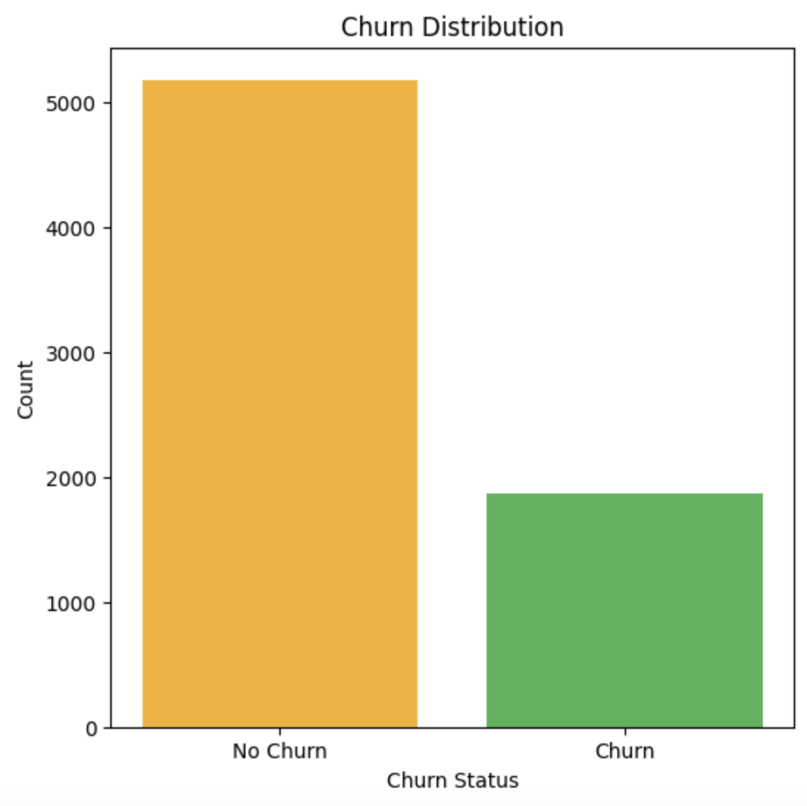
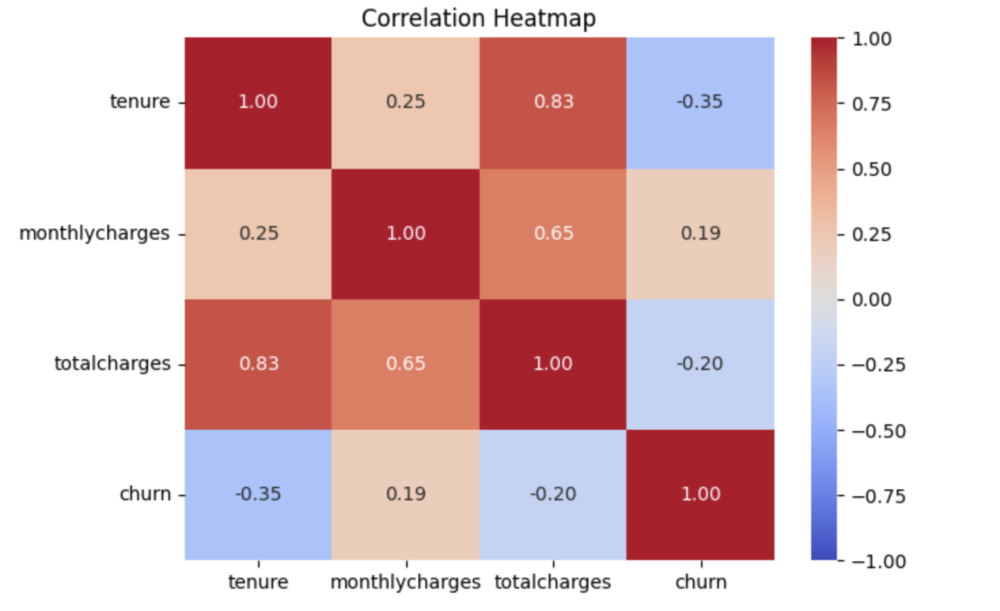
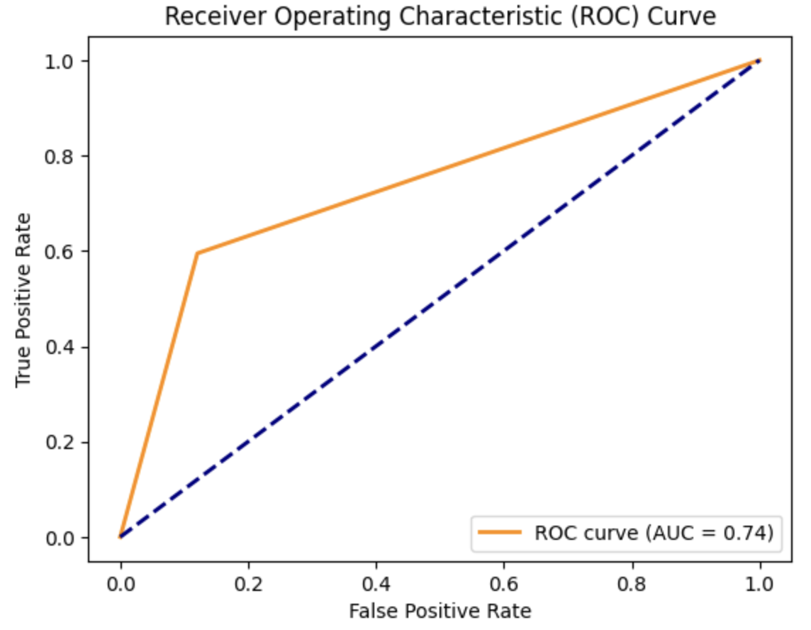
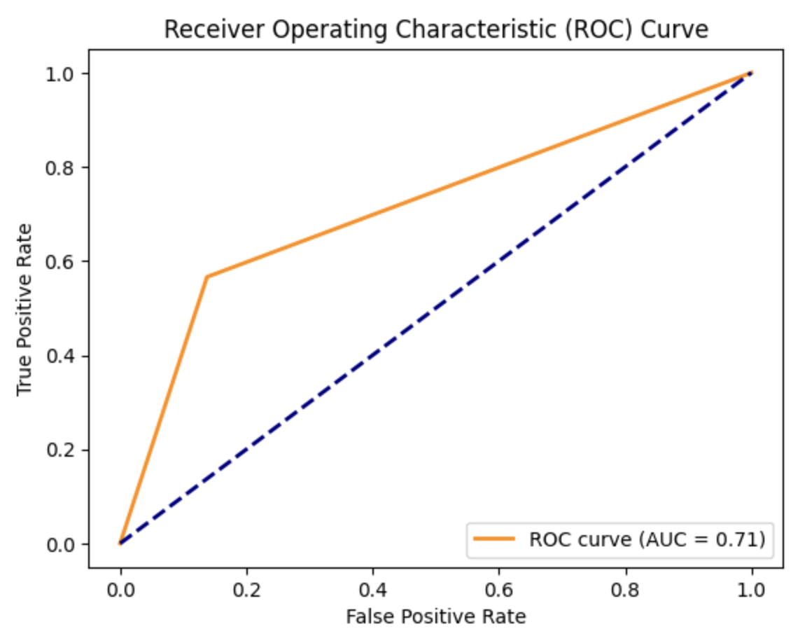
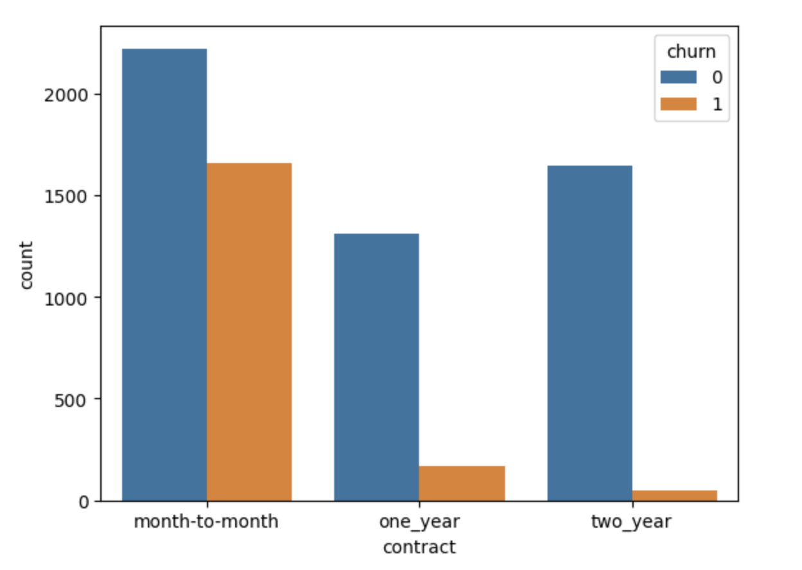
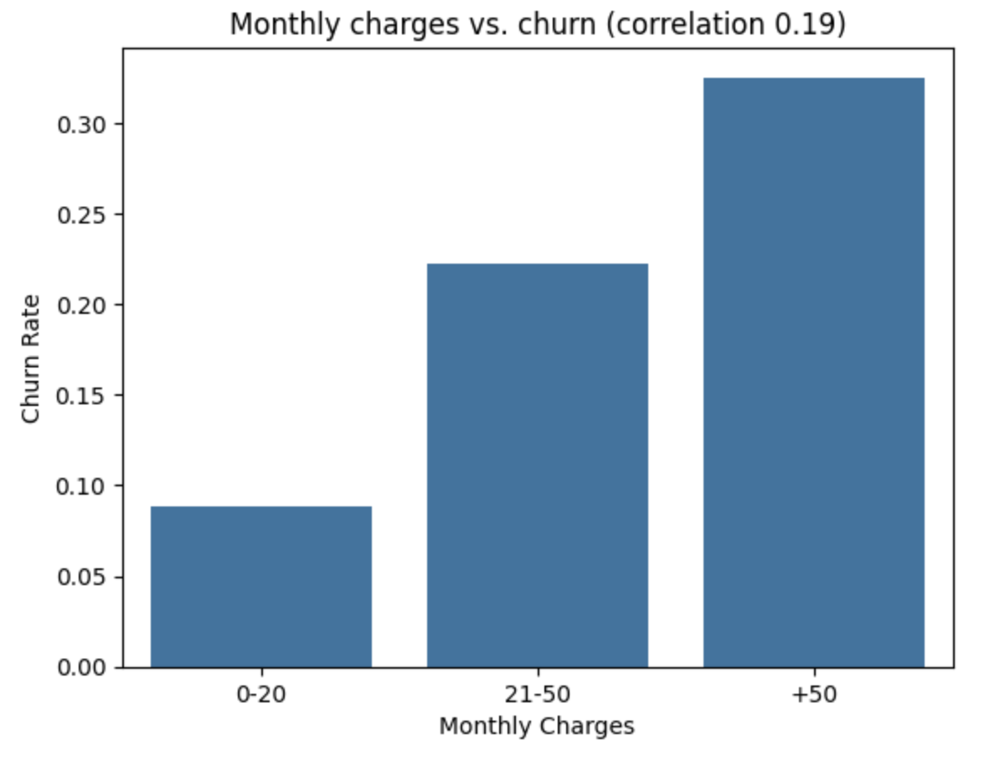
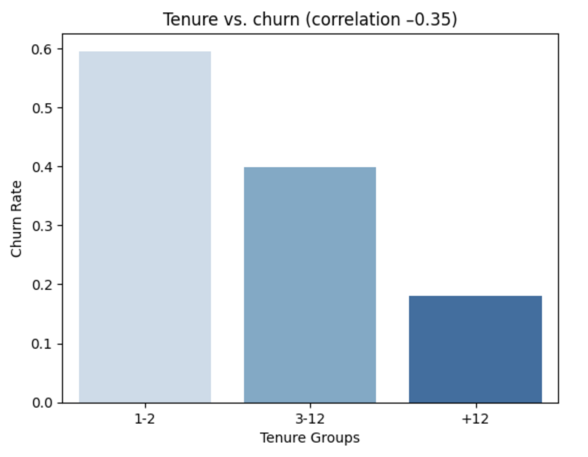

# Telco Customer Churn Prediction
## Project Overview

This project addresses the issue of customer churn at a telecommunications company offering phone and internet services. By predicting which customers are likely to churn, the company can proactively offer incentives and promotions to retain them. The goal is to build a classification model that not only predicts churn but also provides insights into the reasons behind it, enabling better decision-making.

## Objectives
- **Develop a classification model** to predict whether a customer will churn.
- **Identify key factors** contributing to churn.
- **Provide actionable insights** for improving customer retention.
- **Interpret model predictions** to understand churn drivers.

  ## Dataset
- **Name:** Telco Customer Churn Dataset  
- **Source:** [Kaggle - Telco Customer Churn](https://www.kaggle.com/blastchar/telco-customer-churn)  
- **Description:** Contains information about customers' services, account details, and demographics, including churn status.  
- **Target Variable:** `Churn` (Binary: Yes/No)
  ### Churn Distribution

  ## Tools & Technologies
- **Programming Language:** Python  
- **Libraries:** Pandas, NumPy, Scikit-Learn, Matplotlib, Seaborn  
- **Visualization:** Matplotlib, Seaborn  
- **Notebook:** Jupyter Notebook

## Methodology
### 1. Data Exploration
- Handled missing values and outliers.  
- Renamed columns and standardized values for consistency.

### 2. Data Splitting  
- Split data into **train**, **validation**, and **test** sets.  

### 3. Feature Analysis  
- Conducted exploratory data analysis (EDA) to understand feature distributions and relationships.  
- Identified key features contributing to customer churn.

### Correlation Heatmap

### 5. Data Transformation  
- Encoded categorical variables into numerical representations.  
- Scaled numerical features for uniformity across the dataset.  

### 6. Modeling  
- Trained and tested two **Logistic Regression** models (using all features, and using the most important features).  
- Evaluated model performance using:  
  - **Accuracy**  
  - **Precision**  
  - **Recall**  
  - **F1-score**  

### 7. Model Evaluation  
- Analyzed feature importance to interpret the key drivers of churn.  
- Visualized and presented the results to provide key insights.

### 7.1 Evaluation metrics

| Metric       | Model 1              | Model 2             |
|--------------|----------------------|---------------------|
| **Model**    | Logistic Regression  | Logistic Regression |
| **Accuracy** | 81%                  | 79%                 |
| **Precision**| 62%                  | 57%                 |
| **Recall**   | 59%                  | 52%                 |
| **F1-score** | 61%                  | 57%                 |

Model 1 = Using all features
Model 2 = Using only the important features

- **Accuracy**: Model 1 is more reliable in correctly predicting customer churn and retention overall. However, the difference in accuracy is minimal (only 2%), so this difference may not significantly affect the overall business strategy.
- **Precision**: Model 1 has a better precision, meaning that it is more accurate when predicting customers who will churn. This means that Model 1 has fewer false positives, i.e., fewer customers who are predicted to churn but actually stay.
- **Recall**: Model 1 is better at capturing the actual churn cases, meaning fewer false negatives (customers who actually churn but are not identified by the model).
- **F1-score**: Model 1 has a better balance between precision and recall, making it the better overall model for this churn prediction scenario where both false positives and false negatives matter.

### 7.2 ROC Curve 
- Model 1 :
  
  
- Model 2:
  

### 7.3 AUC Score 

| Model       | AUC Score |
|-------------|-----------|
| **Model 1** | 0.74      |
| **Model 2** | 0.71      |

- **Model 1** demonstrates a stronger ability to distinguish between churn and non-churn customers, with a higher AUC score.

### 8. Key insights

1. **Contract Type and Client Retention**

   - **Month-to-month contract clients** are more likely to churn. This suggests that customers with flexible, short-term contracts are not as committed to staying with the company. Consider offering incentives to encourage month-to-month customers to upgrade to one- or two-year contracts to reduce churn.
   - **One-year and two-year contract clients**, on the other hand, are more loyal, with two-year contracts showing the highest retention. This indicates that long-term contracts can be a key strategy for boosting customer loyalty and ensuring a steady revenue stream.
   - **Recommendation**: Promote longer contract options through targeted marketing to clients currently on month-to-month plans.

3. **Dependents**
   - Clients with **dependents** are less likely to churn, suggesting that households with dependents may value stability and be more committed to staying with the company. 
   - **Recommendation**: Develop targeted offers or loyalty programs for clients with dependents, emphasizing stability and long-term benefits.

4. **Device Protection**
   - **Clients with device protection** are more likely to stay. This could indicate that customers who feel more secure (with device protection) are less inclined to leave.
   - **Recommendation**: Focus on upselling device protection to customers, as it can increase customer retention and satisfaction. Similarly, target promotions to customers without protection to highlight the benefits.

5. **Gender**
   - Gender has a minimal impact on churn rates, with both male and female clients showing similar tendencies to stay or leave. This suggests that gender is not a significant factor in customer loyalty for the company.
   - **Recommendation**: Ensure that marketing and retention strategies are gender-neutral and focus on other more impactful factors.

6. **Internet Service**
   - **Fiber optic internet service clients** have the highest retention rates, highlighting the growing demand for high-speed internet. Conversely, clients with **DSL** are more prone to churn.
   - **Recommendation**: Invest in expanding fiber optic service offerings to attract and retain customers. Additionally, offer incentives for customers using DSL or without internet service to upgrade.

7. **Monthly Charges**

- There is a slight correlation between **monthly charges** and customer retention. Higher charges do not seem to significantly drive churn, suggesting that customers are willing to pay for quality service but may need better value propositions to stay.

8. **Tech Support**
   - Clients without **tech support** are more likely to stay, indicating that those who require assistance may be more vulnerable to frustration and churn. It’s possible that a lack of tech support triggers dissatisfaction, leading to higher churn.
   - **Recommendation**: Strengthen customer service, particularly for those who rely on tech support, to enhance satisfaction and reduce churn. Consider offering 24/7 support or priority tech assistance for loyal customers.

9. **Tenure**

- Customers who have been with the company for a **longer tenure** are less likely to churn. This reinforces the idea that established customers are more committed, and the longer a customer stays, the more likely they are to remain loyal.
- **Recommendation**: Focus on increasing customer tenure by offering loyalty benefits, such as exclusive discounts or rewards, to encourage longer relationships.

10. **Total Charges**

- **Total charges** do not appear to have a significant impact on churn. This could suggest that once customers have signed up for a service, they may not closely monitor or be influenced by the total charges alone.
- **Recommendation**: Although total charges are not directly correlated with churn, consider using billing transparency and offering flexible payment plans as part of a broader retention strategy.

---
## Conclusion
By focusing on **contract types**, **service offerings** (like fiber optic and device protection), and emphasizing **customer loyalty** through tenure-based incentives and tailored marketing, the company can enhance its retention efforts and reduce churn.

---
## Suggestions for Further Improvement:
1. For this project, I have used DictVectorizer to encode the categorical features. When performing one-hot encoding using `DictVectorizer`, we may encounter the issue of **multicollinearity**. For example, the one-hot encoding of `Contract` (e.g., `Month-to-month`, `One year`, `Two year`) could introduce redundant columns that represent similar information, which could lead to model instability.
- To address the issues caused by `DictVectorizer`, here are a few alternative approaches and solutions:
  1.  **Drop One Category (Dummy Variable Trap)**: In the case of one-hot encoding, we can drop one of the categories to avoid multicollinearity.
  2.  **Use `OneHotEncoder` from Scikit-learn**:  **`OneHotEncoder`** can handle the multicollinearity problem by automatically removing one category in each feature when applying one-hot encoding.

2. Adding hyperparameter tuning for logistic regression or other models (e.g., Random Forest, XGBoost) to improve performance.

      

